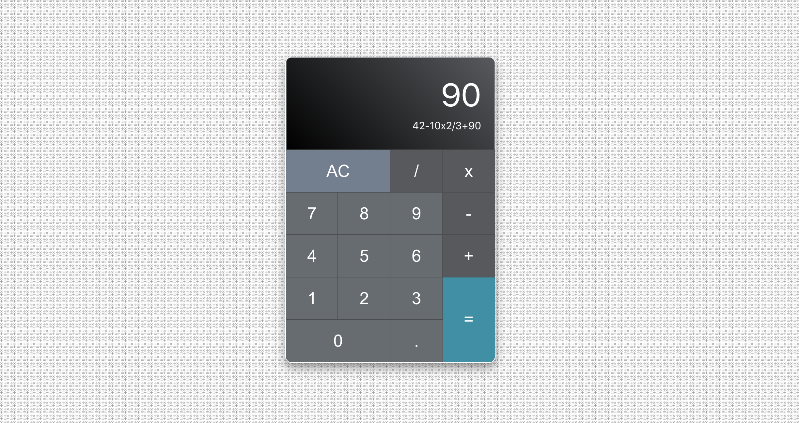

# FRONT END LIBRARIES PROJECT | BUILD A JAVASCRIPT CALCULATOR

> This is the fourth project of _freeCodeCamp "Front End Libraries Projects" Certification_

## HOW TO USE

### 1. Install all dependencies: 
```bash
$ npm install
```

### 2. Run the project in dev mode:
```bash
$ npm start
```

### 3. Open Browser
Open [http://localhost:3000](http://localhost:3000) with your browser to see the result.


## Technology Stack

- **ReactJS**: frontend library (set up with [create-react-app](https://github.com/facebook/create-react-app))
- **SASS**: CSS pre-processors

## SUMMARY

You can use any mix of HTML, JavaScript, CSS, Bootstrap, SASS, React, Redux, and jQuery to complete this project. You should use a frontend framework (like React for example) because this section is about learning frontend frameworks. Happy coding!

### User Stories

|    US    |        Description        |
| :------- | :------------------------ |
| **#1**:  | My calculator should contain a clickable element containing an `=` (equal sign) with a corresponding `id="equals"`. |
| **#2**:  | My calculator should contain 10 clickable elements containing one number each from 0-9, with the following corresponding IDs: `id="zero"`, `id="one"`, `id="two"`, `id="three"`, `id="four"`, `id="five"`, `id="six"`, `id="seven"`, `id="eight"`, and `id="nine"`. |
| **#3**:  | My calculator should contain 4 clickable elements each containing one of the 4 primary mathematical operators with the following corresponding IDs: `id="add"`, `id="subtract"`, `id="multiply"`, `id="divide"`. |
| **#4**:  | My calculator should contain a clickable element containing a `.` (decimal point) symbol with a corresponding `id="decimal"`. |
| **#5**:  | My calculator should contain a clickable element with an `id="clear"`. |
| **#6**:  | My calculator should contain an element to display values with a corresponding `id="display"`. |
| **#7**:  | At any time, pressing the clear button clears the input and output values, and returns the calculator to its initialized state; 0 should be shown in the element with the id of `display`. |
| **#8**:  | As I input numbers, I should be able to see my input in the element with the id of `display`. |
| **#9**:  | In any order, I should be able to add, subtract, multiply and divide a chain of numbers of any length, and when I hit `=`, the correct result should be shown in the element with the id of `display`. |
| **#10**: | When inputting numbers, my calculator should not allow a number to begin with multiple zeros. |
| **#11**: | When the decimal element is clicked, a `.` should append to the currently displayed value; two `.` in one number should not be accepted. |
| **#12**: | If 2 or more operators are entered consecutively, the operation performed should be the last operator entered (excluding the negative (-) sign). For example, if `5 + * 7 =` is entered, the result should be `35` (i.e. 5 * 7); if `5 * - 5 =` is entered, the result should be `-25` (i.e. 5 x (-5)). |
| **#13**: | If 2 or more operators are entered consecutively, the operation performed should be the last operator entered (excluding the negative (-) sign). For example, if `5 + * 7 =` is entered, the result should be `35` (i.e. 5 * 7); if `5 * - 5 =` is entered, the result should be `-25` (i.e. 5 x (-5)). |
| **#14**: | Pressing an operator immediately following `=` should start a new calculation that operates on the result of the previous evaluation. |
| **#15**: | My calculator should have several decimal places of precision when it comes to rounding (note that there is no exact standard, but you should be able to handle calculations like `2 / 7` with reasonable precision to at least 4 decimal places). |


**Note On Calculator Logic**: It should be noted that there are two main schools of thought on calculator input logic: _immediate execution logic and formula logic_. Our example utilizes formula logic and observes order of operation precedence, immediate execution does not. Either is acceptable, but please note that depending on which you choose, your calculator may yield different results than ours for certain equations (see below example). As long as your math can be verified by another production calculator, please do not consider this a bug.

**EXAMPLE:** `3 + 5 x 6 - 2 / 4 =`
- **Immediate Execution Logic:** `11.5`
- **Formula/Expression Logic:** `32.5`